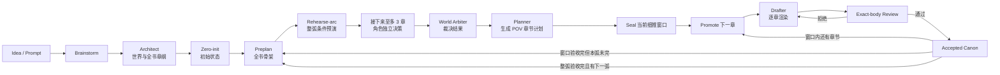

<div align="center">


# novel-studio

**开源、本地优先、可恢复的 AI 长篇小说创作引擎。**

先推演世界与角色，再封存章节计划，最后把主视角真正看见的因果写成正文。

[](https://github.com/Xiaoyangy/novel-studio)
[](https://github.com/Xiaoyangy/novel-studio/releases/latest)
[](https://github.com/Xiaoyangy/novel-studio/actions/workflows/ci.yml)
[](go.mod)
[](#运行要求)
[](LICENSE)

[简体中文](README.md) · [English](README_EN.md)

[快速开始](#快速开始) · [工作流](#生产工作流) · [世界初始化](#可推敲的世界初始化) · [角色-Agent](#角色-agent-决策) · [RAG](#rag-与上下文) · [配置](#模型与部署) · [排障](#常见问题排查)

</div>

---

novel-studio 面向长篇小说、网文连载、短篇整书和故事工作室。它把大纲、人物、世界状态、RAG、正文审核与返工从易丢失的聊天上下文，转换成保存在本机、可验证、可恢复的生产流水线。

它不是“续写上一段”的聊天壳，也不是所见即所得的桌面编辑器。新规划先冻结全书导航并完成整弧条件预演，再让重要角色在接下来至多 3 章的窗口内独立决策并裁决后果；窗口封存后，才逐章渲染、逐章审核。只有通过审核的正文和实际结果会进入正史。

## 核心能力

| 问题 | novel-studio 的处理方式 |
|---|---|
| 角色为了剧情突然降智或提前知道秘密 | 当前弧的重要角色拥有稳定 Agent 身份、私有观察和结构化记忆；World Arbiter 只能裁决结果，不能替角色改意图 |
| 大纲与正文逐渐脱节 | 全书章位先冻结，当前细推窗口再完成角色决定、跨章因果、POV 边界和承载力校验，生成不可变章节合同 |
| RAG 命中很多但正文没有真正使用 | 命中必须绑定来源和内容摘要，先转化为事实锚点或写法方法，再进入 sealed render packet |
| 连载越长，声口、事实和资源越容易漂移 | 已验收正文、人物连续性、关系、资源、伏笔和世界变化都写入结构化台账，下一章按权威状态恢复 |
| 返工后审核了错误版本 | 计划、候选正文、审核、实际变化和发布都绑定 digest 与正文 SHA-256 |
| 长任务中断后只能重跑 | pipeline、弧规划、候选正文、审核和发布都有 checkpoint、租约与幂等恢复 |
| 上下文和重复 token 失控 | 阶段化最小上下文、canonical 数据去重、事件驱动角色激活、短期前缀缓存和可配置预算共同限制消耗 |
| 生产过程是黑箱 | Dashboard 展示弧规划、角色 Agent、正文、RAG、调用量、成本、错误和恢复状态，不展示原始思维链 |

## 运行看板


<details>
<summary><strong>查看人物与离屏世界视图</strong></summary>


</details>

看板是只读的生产控制面：它区分“全书大纲已冻结”“当前弧已正式规划”“章节正在渲染”和“正文已经验收”，不会用单个进度数字掩盖缺失的证据链。

## 快速开始

### 运行要求

- macOS 或 Linux；Windows 请使用 WSL2。
- Release 安装不需要 Go；从源码运行需要 `go.mod` 声明的 Go 1.25.5 或兼容的新版本。
- 至少配置一个可用的文本模型 provider。
- Dashboard 需要 Python 3.9+；页面资源已嵌入 CLI，不需要把源码放在二进制旁边。
- Embedding 与 Qdrant 是可选的增强项；是否完全离线取决于模型、embedding、向量服务和本次流程是否调用联网工具。

### 1. 安装

普通用户使用稳定 Release：

```bash
curl -fsSL https://raw.githubusercontent.com/Xiaoyangy/novel-studio/main/scripts/install.sh | sh
```

安装脚本会选择可写目录、校验 SHA-256，并在需要时打印 `PATH` 修复命令。

需要当前 `main` 的最新能力时，从源码运行：

```bash
git clone https://github.com/Xiaoyangy/novel-studio.git
cd novel-studio
./scripts/run-local.sh doctor
```

源码模式不需要预先构建；`scripts/run-local.sh` 始终运行当前 checkout。下文中的 `novel-studio` 可等价替换为 `./scripts/run-local.sh`。

### 2. 诊断并配置模型

```bash
novel-studio doctor
novel-studio
novel-studio --check
```

- `doctor` 不调用模型、不推进小说状态，只检查系统、目录、配置、Dashboard 和可选 RAG 依赖。
- 第一次直接运行 `novel-studio` 会进入配置向导。
- `--check` 会发起最小真实模型请求，用来验证 provider、model 与 fallback 路由。

全局配置位于 `~/.novel-studio/config.json`；项目级 `./.novel-studio/config.json` 会覆盖它。完整字段见 [config.example.jsonc](config.example.jsonc)。生产环境建议把 `roles.reviewer` 独立路由到 DeepSeek；`--draft-ai-judge` 会严格要求有效 Reviewer 确实使用 DeepSeek。

### 3. 创建一本书

> **版本提示：**下方 `--init-only` 示例适用于当前 `main` 源码。v0.3.0 Release 不支持该选项，请将它替换为 `--stages architect,outline-all,zero-init`（其余参数保留）。重新下载同一版 Release 不会获得尚未发布的功能。

只准备世界、人物、全书导航和初始状态，使用 `--init-only`。完成后命令会退出，不进入整弧角色推演，也不会生成正文：

```bash
novel-studio --pipeline --new-novel --init-only \
  --prompt "写一部 12 章完结的双女主都市悬疑短篇；每章 2000—2500 字"
```

如果希望初始化后继续进入规划与写作，省略 `--init-only`：

```bash
novel-studio --pipeline --new-novel \
  --prompt "写一部 12 章完结的双女主都市悬疑短篇；每章 2000—2500 字；人物边界和结局回收先在章纲中冻结"
```

长期项目更适合把完整创作合同放进文件；下面的命令只完成初始化：

```bash
novel-studio --pipeline --new-novel --init-only --prompt-file prompt.md
```

新项目默认写入 `data/runs/<书名>`。初始化后默认走 `preplan → rehearse-arc → project-all → seal → promote → render`：先整弧条件预演，再细推并封存接下来至多 3 章（弧尾不足 3 章时取剩余章节）。一次 pipeline 调用仍最多完成下一章的渲染与验收，需重复同一命令继续。

### 4. 继续、查看和交付

初始化完成后，对生成的同一书目目录执行下面的恢复命令，继续规划和写作；不要再加 `--new-novel`、`--init-only` 或 `--restart`。

```bash
# 从落盘证据继续下一步
novel-studio --pipeline --dir data/runs/<书名>

# 打开只读进度看板
novel-studio service open

# 生成诊断报告，不推进生产状态
novel-studio --diag --dir data/runs/<书名>
```

重复同一条 pipeline 命令即可逐弧、逐章继续。不要为同一本书并发启动两条 pipeline，也不要手改 `progress.json`、候选目录、事务目录或运行时回执。

满足短篇全文终审范围的项目，在末章和终弧回执齐全后显式交付：

```bash
novel-studio --pipeline --dir data/runs/<书名> --stages finalize,deliver
```

成功后会生成 `output/novel/正文.md`、全文终审和出版包。长篇当前以完整的章级验收链为终态，不会把它冒充成 exact-book 全文终审。

> **路径规则：**pipeline 与 `--diag` 的 `--dir` 指向 `data/runs/<书名>`；`--build-rag` 和 `--rag-ready` 指向该目录下的 `output/novel`；Dashboard 默认扫描当前工作区的 `data/runs/`。

## 生产工作流



五条硬边界保证恢复和质量不会互相冲突：

1. **全书导航先冻结**：卷、弧、章位提供全局方向，但不冒充各章正式计划。
2. **整弧预演，窗口细推**：`rehearse-arc` 由 Architect 与 World Arbiter 的模型调用产生并复核条件预演；它不是角色决定或已发生事实。随后完整细推接下来至多 3 章，才允许 seal。
3. **正文仍逐章生产**：每次只提升下一份 sealed bundle，候选正文始终在隔离目录内生成和审核。
4. **审核通过才进入正史**：失败稿保留诊断，但不会污染 live canon 或正式角色记忆。
5. **窗口接受不等于整弧完成**：窗口逐章验收后，依据真实结果更新剩余弧的预演，再细推下一窗口；只有原逻辑弧的全部窗口形成完整验收汇总，才能进入下一弧。部分窗口不能代替整弧完成证明。

已有 generation 保留原规划范围与协议，不因新默认流程静默插入预演或缩成 3 章。默认恢复遇到无法核实的输入漂移会保留状态并报错；显式 `--stages` 不会自动插入 `rehearse-arc`。`--init-only` 仍只初始化，`finalize,deliver` 仍需显式执行。

预演或封存不代表正文已交付，也不证明真实端到端验收已通过；完成状态以对应正文及验收回执为准。

| 角色 | 职责 |
|---|---|
| Coordinator | 识别当前合法阶段并调度工具，不代替专业 Agent 产出内容 |
| Architect | 建立 premise、人物、世界、卷弧章导航；硬合同冲突时生成 successor generation |
| Character Agent | 只从该角色可见的观察包中选择行动，不读取未来大纲和他人秘密 |
| World Arbiter | 裁决时间、地点、资源、知识与行动碰撞，只决定结果，不修改角色意图 |
| Writer / Planner | 根据最终裁决规划 POV 章节；软情节可重算，硬合同不可绕过 |
| Drafter | 只消费不可变 render packet，把已规划事件渲染为正文 |
| Editor / Reviewer | 对同一份 exact body 做结构、连续性、读感和独立裸正文审核 |

完整 generation、bundle、promotion、outcome 和恢复协议见 [Project-All 按弧架构](docs/project-all-architecture.md) 与 [生产与运维参考](README-TECHNICAL.md)。

## 可推敲的世界初始化

Architect 不再只产出一组设定文字。新项目的世界底座由三份可独立验证的源文件组成：

| 源文件 | 职责 |
|---|---|
| `world_rules.json` | 人能直接阅读的总规则、边界和可见性 |
| `world_codex.json` v2 | 用稳定 `mechanism id` 定义触发、前置、输入、代价、效果、失败、可观测性、耗时与可见性；每条机制都必须有反事实探针 |
| `book_world.json` v2 | 保存可行动地点、路线耗时/风险、势力有限资源、关系与进度钟 |

`--architect-check` 会生成 `meta/world_coherence_report.json` 和便于人审阅的 Markdown 版。报告内容寻址绑定上述作者态设定，检查重复身份、悬空引用、地图断裂、零耗时移动、无资源/无进度钟势力、无失败边界机制以及未被反事实覆盖的捷径。任一硬错会在 zero-init 之前停止；旧 v1 工件仍可读，但会提示待升级项。

角色 Agent 只接收 `formal` / `informal` 机制；`secret` 机制只进入 World Arbiter。Arbiter 还会收到去掉百科描述的紧凑地图和势力快照，并在裁决回执里记录实际使用的 `mechanism_refs`。正常 world tick 只推进势力钟的运行态，不会被误判为作者设定漂移；非法进度仍会在每次复验时被拒绝。

```bash
# pipeline 会自动执行；也可以对已落盘 foundation 单独复核
novel-studio --architect-check --dir data/runs/<书名>/output/novel
```

## 角色 Agent 决策

新项目默认启用 `character-agent-protocol.v1`：

- 主角拥有贯穿全书的稳定 Agent 身份；改名和别名不会创建新身份。
- 当前弧的主角、核心角色和重要配角按事件激活；群众和装饰性角色继续使用群体模拟。
- 每个 Agent 只看到自己的档案、目标、资源、关系、承诺、已知事实与已接受记忆。
- 角色提案并行执行，默认并发上限为 4；角色数没有 8 人硬上限，超出时自动分批。
- Arbiter 最多返回一次最小冲突信息供相关角色修订；第二轮仍无法闭合时停止规划。
- 角色选择改变软大纲时由 Planner 重算；若硬合同已不可实现，则 Architect 创建新的 successor generation。
- 投影记忆只存在于当前 generation；只有正文正式验收后，实际发生且被角色感知的内容才进入长期记忆。
- 系统保存结构化选择、理由、约束、结果和用量，不保存或展示原始思维链。

默认配置如下；角色未单独配置模型时继承 `writer`：

```json
{
  "character_agents": {
    "protocol": "v1",
    "scope": "active_core",
    "activation": "event_driven",
    "max_concurrency": 4,
    "max_revision_rounds": 1
  }
}
```

## RAG 与上下文

RAG 的目标不是把相似文本整段塞给 Drafter，而是提供可追溯、可验证、最小化的依据：

```text
BM25 / embedding / Qdrant 命中
              ↓
exact source ref + content-addressed receipt
              ↓
Planner 转换为事实锚点或写法方法
              ↓
sealed render packet
              ↓
Drafter 只读取已授权的最小输入
```

| 数据层 | 内容与边界 |
|---|---|
| 本书事实 | 世界规则、角色状态、章节事实、关系、资源和伏笔；可以进入事实向量索引 |
| 共享写法 | 对话、场景、节奏、类型技巧和审核校准；只能迁移方法，不能成为正史 |
| 本地权威 | `meta/rag/index_state.json` 是索引清单，`vector_store.json` 是可恢复向量源 |
| 在线缓存 | Qdrant 提供低延迟检索，但不能反向覆盖本地权威；内容不一致时会重建 |
| 检索审计 | query、策略、命中、理由和 receipt 保留用于回放与验真 |

```bash
# 构建或刷新单本书索引
novel-studio --build-rag --dir data/runs/<书名>/output/novel

# 修复并验证 embedding、本地向量与 Qdrant 一致性
novel-studio --rag-ready --dir data/runs/<书名>/output/novel

# 只读审计全部正式、投影、候选和归档快照
novel-studio rag audit --root data/runs

# 先备份，再修复正式索引并物理去重相同历史快照
novel-studio rag maintain --root data/runs --apply
```

每次当前弧推演都会冻结独立的 `rag_snapshot_root`。Drafter 看不到 raw hits，也不会在 render 阶段临时连接 live Qdrant。详细创建、检索、防串库、维护与全量数据复审见 [RAG 全生命周期审计](docs/design-audits/rag-full-lifecycle-audit-20260905.md)。

### Token 与执行效率

- 聚焦 profile 只保留 canonical 上下文，精确相同的顶层镜像会在首次预算检查前删除。
- 大纲、角色等基础数据在一次 `novel_context` 调用内复用，不反复读取和解析。
- 中文恢复包按 CJK token 估算裁剪，并始终保持合法 UTF-8 与 JSON。
- 重要角色只在出场、收到信息、行动到期、资源/关系变化或承诺触发时调用模型；休眠角色不消耗调用。
- 多轮 Agent 使用短期前缀缓存；OpenAI 官方端接收不含项目路径和角色名的哈希路由键。
- 任意 OpenAI-compatible 代理默认不接收专有缓存参数；确认兼容后，才在 provider 的 `extra` 中设置 `"prompt_cache_params": true`。
- Dashboard 和 usage ledger 分角色记录 input、output、cache read/write 与成本；`budget.book_usd` 可设置单书告警和停止线。

上下文压缩、恢复包与 receipt 的细节见 [上下文管理](docs/context-management.md)。

## 正文质量与一致性

每章必须同时回答四个问题：

- **事实对不对**：金额、数量、时间、地点、授权、知识边界和因果顺序是否符合 sealed plan。
- **故事是否成立**：目标、阻力、行动、转折、关系位移、读者回报和章末前推力是否完整。
- **文字是否像小说**：是否出现流程报告、过度解释、同构节奏、对白传送带或元数据泄漏。
- **审核对象是否一致**：Drafter、Editor、Reviewer、consistency、commit 与交付是否绑定同一正文 SHA。

配置风格只改变叙述声口、距离、句法、节奏、意象、段落和对白质感，不能改变事件、人物决定、事实、状态或 POV 知识边界。系统还会从已验收正文构建 serial style memory，识别跨章逐字复现、非必要短语和同构开收尾；章节标题与正史专名会被排除，避免为了防重复而破坏连续性。

候选只有在确定性门禁、Editor、独立 Reviewer、实际状态变化和计划合同全部一致后才原子发布。外部人工检测只作为用户可选抽查，不会被自动操作，也不会因未知结果阻塞生产。详见 [写作审核工作流](docs/writing-review-workflow.md) 与 [外部检测协议](docs/external-detector-protocol.md)。

## 模型与部署

novel-studio 支持按角色选择 provider、model、reasoning effort 和 fallback。当前适配器覆盖 OpenAI、Anthropic、Gemini、OpenRouter、DeepSeek、Qwen、GLM、Grok、MiniMax、Mimo、Ollama、Bedrock、OpenAI-compatible 代理与本机 Codex CLI；适配器存在不代表每个模型版本都完成了全部生产角色验证。

| 配置键 | 作用 |
|---|---|
| `provider` / `model` | 默认文本模型 |
| `providers` | 凭证、协议、base URL、模型列表与附加参数 |
| `providers.*.mcp_inventory_timeout_sec` | Codex CLI 调用前的 MCP 清单隔离超时；默认 15 秒，可配 1–120 秒 |
| `roles` | Coordinator、Architect、Writer、Character、World Arbiter、Drafter、Editor、Reviewer 的独立路由 |
| `character_agents` | 激活范围、并发和冲突修订轮次 |
| `context_window` | 自定义模型的真实窗口或提前压缩上限 |
| `rag.embedding` / `rag.qdrant` | Embedding 与向量检索 |
| `budget` | 单书成本告警和硬停止 |
| `notify` | 桌面或自定义通知 |

**Local-first 不等于默认完全离线。** 项目文件和编排状态保存在本机；正文是否发送到远程取决于你选择的 provider。即使文本模型、embedding 和 Qdrant 都在本地，`web_research` 等工具仍可能联网。不要把真实 API key 提交到仓库，优先使用 `api_key_env`。

Docker 快速入口：

```bash
mkdir -p config workspace
docker compose run --rm novel-studio
docker compose run --rm novel-studio doctor --dir /workspace
docker compose run --rm novel-studio --check
```

要从容器启动 Dashboard：

```bash
docker compose run --rm --service-ports novel-studio service start --host 0.0.0.0
```

随后打开 [http://127.0.0.1:8765/](http://127.0.0.1:8765/)。Compose 内启用 Qdrant 时，`rag.qdrant.url` 应使用 `http://qdrant:6333`。

## 常用命令

下表中的 `<RUN>` 表示 `data/runs/<书名>`。

| 命令 | 用途 |
|---|---|
| `novel-studio doctor [--dir <RUN>]` | 不调用模型，检查环境并给出修复建议 |
| `novel-studio --check` | 验证 provider、model 和 fallback 连通性 |
| `novel-studio --pipeline --new-novel --init-only --prompt "..."` | 当前 main：仅初始化后退出；v0.3.0 将 `--init-only` 换为 `--stages architect,outline-all,zero-init` |
| `novel-studio --pipeline --new-novel --prompt "..."` | 创建书目并启动完整流程 |
| `novel-studio --pipeline --dir <RUN>` | 从可信证据恢复下一步 |
| `novel-studio --pipeline --dir <RUN> --stages preplan,rehearse-arc,project-all,seal` | 在新规划边界完成整弧条件预演与接下来至多 3 章的细推封存，不写正文 |
| `novel-studio --pipeline --dir <RUN> --stages promote,render` | 渲染并审核下一份 sealed chapter bundle |
| `novel-studio --pipeline --dir <RUN> --stages finalize,deliver` | 为符合范围的短篇执行全文终审和交付 |
| `novel-studio --architect-check --dir <RUN>/output/novel` | 生成并验证世界自洽证明，不进入正文 |
| `novel-studio --build-rag --dir <RUN>/output/novel` | 构建项目 RAG 索引 |
| `novel-studio --rag-ready --dir <RUN>/output/novel` | 验证并恢复 RAG 与 Qdrant |
| `novel-studio rag audit --root data/runs` | 只读审计全部 RAG 快照 |
| `novel-studio rag maintain --root data/runs --apply` | 备份、修复并去重正式索引 |
| `novel-studio service open` | 启动或打开 Dashboard |
| `novel-studio --diag --dir <RUN>` | 生成诊断报告，不推进小说状态 |
| `novel-studio --version` | 查看版本 |
| `novel-studio update [version]` | 更新 Release 安装 |

使用 `novel-studio --pipeline --help`、`novel-studio service --help` 和 `novel-studio rag --help` 查看完整选项。高级 rebase、outline repair、successor generation 和慢章诊断集中在 [生产与运维参考](README-TECHNICAL.md)。

## 项目数据

```text
data/runs/<书名>/
├── brainstorm.md
├── prompt.md                         # 可选：稳定创作合同
├── archives/                         # rebase 前的可恢复归档
└── output/
    ├── .render-candidates/           # 隔离候选、拒稿与诊断
    ├── .render-transactions/         # 不可变阶段回执
    └── novel/
        ├── premise.md
        ├── characters.json
        ├── layered_outline.json
        ├── world_rules.json
        ├── world_codex.json             # 机制、代价、失败与反事实探针
        ├── book_world.json              # 地点、路线、势力资源与进度钟
        ├── chapters/                 # 已验收正文
        ├── reviews/                  # exact-body 审核证据
        ├── 正文.md                   # 短篇 finalize 后的全文
        └── meta/
            ├── character_agents/     # 注册表、观察、决定、裁决与记忆
            ├── world_coherence_report.json # 内容寻址的世界自洽证明
            ├── rag/                  # 索引、向量、trace、receipt 与健康摘要
            └── ...                   # 进度、世界状态、规划与发布回执
```

项目真相以落盘工件为准，不以聊天历史、模型自述或单个进度数字为准。

## 常见问题排查

| 现象 | 建议 |
|---|---|
| `novel-studio: command not found` | 执行安装脚本最后打印的 `export PATH=...`，或直接使用安装后的绝对路径 |
| 不确定本机缺什么 | 先运行 `novel-studio doctor`；它不会调用模型 |
| Provider 配置通过但模型不可用 | 运行 `novel-studio --check`，核对 provider key、model、base URL、额度和角色 fallback |
| Release 没有 README 中的新能力 | 先用 `--version` 核对版本；README 描述当前 `main`，未发布的功能需用 `./scripts/run-local.sh` 运行源码。v0.3.0 不支持 `--init-only`，改用 `--stages architect,outline-all,zero-init` |
| Pipeline 中断或看似卡住 | 再次执行完全相同的 pipeline 命令；用 `service open` 或 `--diag` 查看 checkpoint，禁止手改回执 |
| RAG 没有命中或 Qdrant 不一致 | 依次执行 `--build-rag`、`--rag-ready`，需要全盘核对时先运行只读 `rag audit` |
| Dashboard 打不开 | 运行 `novel-studio service status`；需要前台日志时使用 `service start` |
| 同一本书提示执行锁 | 确认没有另一条 pipeline 正在运行；异常退出后按诊断建议恢复，不要删除锁文件 |

若问题仍然存在，请提交 [GitHub Issue](https://github.com/Xiaoyangy/novel-studio/issues)，附上版本、平台、执行命令和 `--diag` 的脱敏结果，不要上传 API key 或未授权正文。

## 适用范围

适合：

- 需要写几十章到数百章，并长期维护人物、关系、资源、伏笔和知识边界的作者。
- 希望掌控模型、RAG、成本和本地项目文件的开发者或内容团队。
- 研究多 Agent 写作、世界模拟、长上下文治理和可恢复 pipeline 的工程师。

当前限制：

- 它不是拖拽式桌面写作软件，也不承诺一条提示词无人值守交付完美百万字成书。
- 百万字级连续性是架构目标，不等于已经完成百万字作品的公开生产质量验证。
- 最终质量仍取决于创作合同、模型能力、RAG 资料、审核标准、预算和作者抽查。
- 全文 exact-book finalize 当前只对满足终审合同的短篇开放；长篇使用逐章和逐弧验收链。

## 文档

| 文档 | 内容 |
|---|---|
| [生产与运维参考](README-TECHNICAL.md) | 执行锁、receipt、恢复、rebase、outline repair、命令和完整输出结构 |
| [系统架构](docs/architecture.md) | Host、Agent、Tools、Store 与上下文拓扑 |
| [Project-All 按弧架构](docs/project-all-architecture.md) | 当前弧推演、seal、逐章验收和下一弧解锁 |
| [角色执行策略 V3](docs/character-activation-v3.md) | 配置、初始化与生产入口、旧代次兼容和真实验收边界 |
| [设计阶段工作流](docs/design-stage-workflow.md) | Architect、outline-all 与 zero-init |
| [上下文管理](docs/context-management.md) | 阶段化压缩、恢复包和上下文 receipt |
| [数据生命周期](docs/data-lifecycle-and-progression.md) | 章节、角色、世界与推进台账 |
| [写作审核工作流](docs/writing-review-workflow.md) | draft、review、rewrite、commit 与 deliver |
| [RAG 全生命周期审计](docs/design-audits/rag-full-lifecycle-audit-20260905.md) | 创建、检索、防串库、维护和存量数据复审 |
| [评测系统](docs/evaluation-system.md) | 测试案例、指标与回归 |
| [可观测性](docs/observability.md) | 事件、usage、trace 与诊断 |

## 开发与验证

```bash
go test -count=1 ./...
go test -race ./internal/agents ./internal/agents/ctxpack ./internal/tools ./internal/store ./services/dashboard
go vet ./...
go build -o /tmp/novel-studio ./cmd/novel-studio

python3 scripts/validate_skill_context.py
python3 -m unittest discover -s quality/audit/scripts -p 'test_*.py' -v
python3 -m unittest services.dashboard.test_server -v

git diff --check
```

涉及 pipeline、存储合同或恢复路径的改动必须附带回归测试。欢迎提交 [Issue](https://github.com/Xiaoyangy/novel-studio/issues) 或 Pull Request。

## License

[Apache License 2.0](LICENSE)

<div align="center">

如果这个项目对你有帮助，欢迎 [⭐ Star](https://github.com/Xiaoyangy/novel-studio) · [提交 Issue](https://github.com/Xiaoyangy/novel-studio/issues) · 分享你的使用经验。

</div>
