<div align="center">


# novel-studio

**An open-source, local-first, recoverable AI engine for long-form fiction.**

Simulate the world and its characters, seal the chapter plan, then render only the causality the point-of-view character can actually perceive.

[](https://github.com/Xiaoyangy/novel-studio)
[](https://github.com/Xiaoyangy/novel-studio/releases/latest)
[](https://github.com/Xiaoyangy/novel-studio/actions/workflows/ci.yml)
[](go.mod)
[](#requirements)
[](LICENSE)

[简体中文](README.md) · [English](README_EN.md)

[Quick start](#quick-start) · [Pipeline](#production-pipeline) · [Character Agents](#independent-character-agents) · [RAG](#rag-and-context) · [Configuration](#models-and-deployment) · [Troubleshooting](#troubleshooting)

</div>

---

novel-studio is designed for novels, serialized fiction, complete short books, and story-production teams. It turns outlines, character state, world state, RAG, reviews, and rewrites from fragile chat history into a local, verifiable, recoverable production pipeline.

It is not a “continue the previous paragraph” chat wrapper, nor a WYSIWYG desktop editor. New planning freezes the book-wide navigation and rehearses the whole arc conditionally, then lets important characters make independent decisions within the next window of at most three chapters. Only after those consequences are arbitrated and the window is sealed does it render and review prose chapter by chapter. Only accepted prose and observed outcomes become canon.

## Core capabilities

| Problem | How novel-studio handles it |
|---|---|
| Characters become irrational for plot convenience or know secrets too early | Important characters in the current arc have stable Agent identities, private observations, and structured memory; the World Arbiter may resolve outcomes but cannot rewrite intent |
| The outline and prose drift apart | Book-wide chapter slots are frozen first; each detailed planning window then binds character decisions, cross-chapter causality, POV boundaries, and render capacity into immutable chapter contracts |
| RAG retrieves plenty but the prose does not use it | Every hit is bound to an exact source and content digest, transformed into a fact anchor or craft method, and only then admitted to the sealed render packet |
| Voice, facts, resources, and relationships drift over a long serialization | Accepted prose, continuity, relationships, resources, foreshadowing, and world changes are persisted as structured ledgers |
| A rewrite is reviewed against the wrong body | Plans, candidates, reviews, actual deltas, and publication are bound to digests and the exact body SHA-256 |
| A long run crashes and must start over | Pipeline phases, arc projections, draft candidates, reviews, and publication use checkpoints, leases, and idempotent recovery |
| Repeated context and input tokens grow without control | Stage-specific minimal context, canonical de-duplication, event-driven activation, short-lived prefix caching, and configurable budgets bound the cost |
| Production is a black box | The Dashboard shows arc planning, Character Agents, prose, RAG, usage, cost, errors, and recovery state without exposing raw chain-of-thought |

## Runtime dashboard


<details>
<summary><strong>See character and off-screen world views</strong></summary>


</details>

The Dashboard is a read-only production control plane. It distinguishes a frozen book outline, a formally planned arc, a chapter being rendered, and accepted prose instead of collapsing them into one misleading progress number.

## Quick start

### Requirements

- macOS or Linux. On Windows, use WSL2.
- Release binaries do not require Go. Running from source requires Go 1.25.5, as declared by `go.mod`, or a compatible newer toolchain.
- At least one working text-model provider.
- Python 3.9+ for the Dashboard. Its web assets are embedded in the CLI, so a source checkout is not required beside a Release binary.
- Embeddings and Qdrant are optional enhancements. A run is fully offline only when every active model and retrieval component is local and no network tool is invoked.

### 1. Install

Most users should install the stable Release:

```bash
curl -fsSL https://raw.githubusercontent.com/Xiaoyangy/novel-studio/main/scripts/install.sh | sh
```

The installer selects a writable destination, verifies SHA-256, and prints a `PATH` fix when needed.

Use the current `main` branch when you need unreleased features:

```bash
git clone https://github.com/Xiaoyangy/novel-studio.git
cd novel-studio
./scripts/run-local.sh doctor
```

Source mode needs no separate build step: `scripts/run-local.sh` always runs the current checkout. You can replace `novel-studio` in the commands below with `./scripts/run-local.sh`.

### 2. Diagnose and configure models

```bash
novel-studio doctor
novel-studio
novel-studio --check
```

- `doctor` does not call a model or advance project state. It checks the platform, directories, configuration, Dashboard, and optional RAG dependencies.
- Running `novel-studio` directly starts the first-run configuration wizard.
- `--check` sends a minimal real request to validate provider, model, and fallback routing.

Global configuration lives at `~/.novel-studio/config.json`; `./.novel-studio/config.json` overrides it for one project. See [config.example.jsonc](config.example.jsonc) for every field. In production, route `roles.reviewer` independently to DeepSeek. The dedicated `--draft-ai-judge` command verifies that the effective Reviewer really is a DeepSeek route.

### 3. Start a book

> **Version note:** the `--init-only` examples below require the current `main` source. Release v0.3.0 does not support this flag; replace it with `--stages architect,outline-all,zero-init` and keep the other arguments. Reinstalling the same Release does not add unreleased features.

To prepare the world, characters, book outline, and opening state only, add `--init-only`. The command exits after initialization; it does not simulate the arc or generate prose:

```bash
novel-studio --pipeline --new-novel --init-only \
  --prompt "A complete 12-chapter dual-protagonist urban mystery, 2,000–2,500 Chinese characters per chapter."
```

Omit `--init-only` to continue into planning and writing after initialization:

```bash
novel-studio --pipeline --new-novel \
  --prompt "Write a complete 12-chapter dual-protagonist urban mystery, 2,000–2,500 Chinese characters per chapter; freeze character boundaries and ending payoffs in the outline first."
```

For a long-running project, keep the creative contract in a file; this command performs initialization only:

```bash
novel-studio --pipeline --new-novel --init-only --prompt-file prompt.md
```

New projects are written under `data/runs/<book>`. After initialization, the default is `preplan → rehearse-arc → project-all → seal → promote → render`: rehearse the whole arc conditionally, then detail and seal the next at most three chapters (or the remaining chapters at the arc's end). One invocation still completes at most the next chapter's render-and-accept cycle; repeat the same command to continue.

### 4. Resume, inspect, and deliver

After initialization, run the resume command below against the same generated book directory to continue planning and writing. Leave out `--new-novel`, `--init-only`, and `--restart`.

```bash
# Resume from durable evidence
novel-studio --pipeline --dir data/runs/<book>

# Open the read-only Dashboard
novel-studio service open

# Produce diagnostics without advancing the novel
novel-studio --diag --dir data/runs/<book>
```

Repeat the same pipeline command to continue arc by arc and chapter by chapter. Never run two pipelines for the same book at once, and do not hand-edit progress, candidate directories, transaction directories, or runtime receipts.

For an eligible short book, run exact-book final review after the last chapter and final arc receipts exist:

```bash
novel-studio --pipeline --dir data/runs/<book> --stages finalize,deliver
```

This produces `output/novel/正文.md`, the whole-book review, and a publication package. Long-form projects currently end with a complete chapter-level acceptance chain; the system does not mislabel that as an exact-book final review.

> **Path rule:** pipeline and `--diag` expect `data/runs/<book>`; `--build-rag` and `--rag-ready` expect its `output/novel` directory; the Dashboard scans `data/runs/` in the current workspace by default.

## Production pipeline

```mermaid
flowchart LR
    I["Idea / Prompt"] --> B["Brainstorm"]
    B --> A["Architect<br/>world + book outline"]
    A --> Z["Zero-init<br/>initial state"]
    Z --> F["Preplan<br/>book skeleton"]
    F --> H["Rehearse-arc<br/>conditional whole-arc forecast"]
    H --> C["Next at most 3 chapters<br/>independent character decisions"]
    C --> W["World Arbiter<br/>resolved outcomes"]
    W --> P["Planner<br/>POV chapter plans"]
    P --> S["Seal current planning window"]
    S --> M["Promote next chapter"]
    M --> D["Drafter<br/>chapter render"]
    D --> R["Exact-body Review"]
    R -->|accepted| K["Accepted Canon"]
    R -->|rejected| D
    K -->|more chapters in window| M
    K -->|window accepted, arc unfinished| F
    K -->|arc accepted, another arc remains| F
```



Five hard boundaries keep recovery and quality compatible:

1. **Freeze book navigation first.** Volumes, arcs, and chapter slots define global direction but do not pretend to be formal chapter plans.
2. **Rehearse the arc, detail one window.** `rehearse-arc` uses Architect and World Arbiter model calls to produce and review a conditional forecast—not character decisions or events that have occurred. The next at most three chapters are then fully planned before sealing.
3. **Produce prose chapter by chapter.** Each run promotes only the next sealed bundle; draft and review work stays in an isolated candidate directory.
4. **Only accepted bodies become canon.** Rejected drafts retain diagnostics but cannot contaminate live canon or canonical character memory.
5. **An accepted window is not a completed arc.** After every chapter in a window is accepted, actual outcomes update the remaining arc's rehearsal before the next window is planned. Only a complete acceptance aggregate covering every window of the original logical arc unlocks the next arc; a partial window set is insufficient.

Existing generations retain their original planning range and protocol; the new default does not silently insert a rehearsal or shorten them to three chapters. Default recovery preserves state and reports input drift it cannot authenticate. Explicit `--stages` does not automatically add `rehearse-arc`. `--init-only` still performs initialization only, and `finalize,deliver` remains explicit.

A rehearsal or sealed plan does not mean prose has been delivered or that real end-to-end acceptance has passed. Completion requires the corresponding prose and acceptance receipts.

| Role | Responsibility |
|---|---|
| Coordinator | Finds the currently legal phase and dispatches tools; it does not replace specialist Agents |
| Architect | Builds the premise, cast, world, and book map; creates a successor generation when a hard contract becomes infeasible |
| Character Agent | Chooses from a private observation packet without seeing future outline material or another character's secrets |
| World Arbiter | Resolves time, place, resources, knowledge, rules, and collisions; it decides outcomes without modifying intent |
| Writer / Planner | Builds POV chapter plans from final arbitration; soft plot can be recomputed, hard contracts cannot be bypassed |
| Drafter | Consumes only the immutable render packet and turns planned events into prose |
| Editor / Reviewer | Evaluate the same exact body for structure, continuity, reader experience, and independent raw-prose quality |

See [Project-All arc architecture](docs/project-all-architecture.md) and the [production and operations reference](README-TECHNICAL.md) for generation, bundle, promotion, outcome, and recovery details.

## Independent Character Agents

New projects enable `character-agent-protocol.v1` by default:

- Protagonists keep stable Agent identities across the book; renames and aliases do not create new identities.
- Protagonists, core characters, and important supporting characters in the current arc activate on events. Crowds and decorative characters remain group simulations.
- Each Agent sees only its profile, goals, resources, relationships, commitments, known facts, and accepted memory.
- Proposals run concurrently with a default cap of four. There is no eight-character limit; larger casts are batched automatically.
- The Arbiter may return minimal conflict information once to only the affected characters. If the second round still cannot close, planning stops.
- When character choices break a soft outline, the Planner recomputes it. If a hard contract becomes infeasible, the Architect creates a successor generation.
- Projected memory stays inside its generation. Only accepted events that the character actually perceived are promoted to canonical long-term memory.
- The system stores structured choices, concise reasons, constraints, outcomes, and usage—not raw chain-of-thought.

These defaults apply when a role does not override them; `character` and `world_arbiter` otherwise inherit the Writer model:

```json
{
  "character_agents": {
    "protocol": "v1",
    "scope": "active_core",
    "activation": "event_driven",
    "max_concurrency": 4,
    "max_revision_rounds": 1
  }
}
```

## RAG and context

RAG is not a mechanism for dumping similar passages into the Drafter's prompt. It is a traceable, verifiable, minimal evidence pipeline:

```text
BM25 / embedding / Qdrant hit
              ↓
exact source ref + content-addressed receipt
              ↓
Planner converts it into a fact anchor or craft method
              ↓
sealed render packet
              ↓
Drafter reads only the authorized minimum
```

| Data layer | Content and boundary |
|---|---|
| Book facts | World rules, character state, chapter facts, relationships, resources, and foreshadowing; eligible for the fact vector index |
| Shared craft | Dialogue, scene, pacing, genre, benchmark, and review material; methods only, never canon |
| Local authority | `meta/rag/index_state.json` is the index manifest; `vector_store.json` is the recoverable vector source |
| Online cache | Qdrant provides low-latency retrieval but cannot overwrite local authority; mismatched content is rebuilt |
| Retrieval audit | Queries, strategies, hits, reasons, and receipts remain available for replay and verification |

```bash
# Build or refresh one book's index
novel-studio --build-rag --dir data/runs/<book>/output/novel

# Repair and verify embeddings, local vectors, and Qdrant
novel-studio --rag-ready --dir data/runs/<book>/output/novel

# Read-only audit of canonical, projected, candidate, and archived snapshots
novel-studio rag audit --root data/runs

# Back up first, then repair canonical indexes and de-duplicate identical snapshots
novel-studio rag maintain --root data/runs --apply
```

Every arc projection freezes its own `rag_snapshot_root`. The Drafter never sees raw hits or connects to live Qdrant during rendering. See the [RAG lifecycle audit](docs/design-audits/rag-full-lifecycle-audit-20260905.md) for creation, retrieval, cross-project isolation, maintenance, and the full stored-data review.

### Token and execution efficiency

- Focused profiles retain canonical context only; exact root-level mirrors are removed before the first budget check.
- Outline, character, and other foundation data is reused within one `novel_context` call instead of being read and parsed repeatedly.
- Chinese restore packets use CJK-aware token estimates and remain valid UTF-8 and JSON after truncation.
- Important characters call a model only when appearance, information, deadline, resource, relationship, or commitment events activate them. Sleeping characters cost no model call.
- Multi-turn Agents use short-lived prefix caching. The official OpenAI endpoint receives an opaque routing hash that contains no project path or character name.
- Arbitrary OpenAI-compatible relays do not receive proprietary cache parameters by default. Opt in with `"prompt_cache_params": true` under provider `extra` only after verifying relay support.
- The Dashboard and usage ledger track input, output, cache read/write, and cost by role. `budget.book_usd` can set a per-book warning and stop line.

See [context management](docs/context-management.md) for compaction, restore packs, and context receipts.

## Prose quality and consistency

Every chapter must answer four questions:

- **Are the facts correct?** Amounts, counts, time, place, authorization, knowledge, and causality must match the sealed plan.
- **Does the story work?** Goals, resistance, actions, turns, relationship movement, reader payoff, and forward pull must be present.
- **Does it read like fiction?** Process-report prose, over-explanation, repetitive rhythm, dialogue conveyor belts, and metadata leakage are rejected.
- **Was the right body reviewed?** Drafter, Editor, Reviewer, consistency, commit, and delivery evidence must bind the same body SHA.

Configured style changes only voice, narrative distance, syntax, rhythm, imagery, paragraphing, and dialogue texture. It cannot alter events, decisions, facts, state, or POV knowledge. Accepted prose also feeds serial style memory that detects unnecessary repeated phrases, exact sentence reuse, and structurally identical openings or endings while excluding canonical names and chapter titles.

A candidate is atomically published only after deterministic gates, the Editor, the independent Reviewer, actual state changes, and the plan contract agree. External human detectors remain optional user-supplied spot checks; novel-studio does not operate them or block on unknown results. See the [writing and review workflow](docs/writing-review-workflow.md) and [external detector protocol](docs/external-detector-protocol.md).

## Models and deployment

Each role can select its own provider, model, reasoning effort, and fallbacks. Adapters currently cover OpenAI, Anthropic, Gemini, OpenRouter, DeepSeek, Qwen, GLM, Grok, MiniMax, Mimo, Ollama, Bedrock, OpenAI-compatible relays, and the local Codex CLI. Adapter support does not imply that every model version has been production-validated in every role.

| Configuration key | Purpose |
|---|---|
| `provider` / `model` | Default text model |
| `providers` | Credentials, protocol, base URL, model list, and provider extras |
| `providers.*.mcp_inventory_timeout_sec` | MCP inventory isolation timeout before Codex CLI calls; defaults to 15 seconds, configurable from 1 to 120 |
| `roles` | Independent routing for Coordinator, Architect, Writer, Character, World Arbiter, Drafter, Editor, and Reviewer |
| `character_agents` | Activation scope, concurrency, and conflict revision rounds |
| `context_window` | The real window for a custom model or an earlier compaction ceiling |
| `rag.embedding` / `rag.qdrant` | Embedding and vector retrieval |
| `budget` | Per-book cost warning and hard stop |
| `notify` | Desktop or custom notifications |

**Local-first does not mean offline by default.** Project files and orchestration state stay on your machine; whether prose leaves it depends on the configured provider. Even with local text models, embeddings, and Qdrant, tools such as `web_research` may still use the network. Never commit real API keys; prefer `api_key_env`.

Docker quick start:

```bash
mkdir -p config workspace
docker compose run --rm novel-studio
docker compose run --rm novel-studio doctor --dir /workspace
docker compose run --rm novel-studio --check
```

To start the Dashboard from Compose:

```bash
docker compose run --rm --service-ports novel-studio service start --host 0.0.0.0
```

Then open [http://127.0.0.1:8765/](http://127.0.0.1:8765/). When using the Compose Qdrant service, set `rag.qdrant.url` to `http://qdrant:6333`.

## Common commands

`<RUN>` means `data/runs/<book>` below.

| Command | Purpose |
|---|---|
| `novel-studio doctor [--dir <RUN>]` | Check the environment without calling a model |
| `novel-studio --check` | Verify provider, model, and fallback connectivity |
| `novel-studio --pipeline --new-novel --init-only --prompt "..."` | Current main: initialize, then exit; on v0.3.0 replace `--init-only` with `--stages architect,outline-all,zero-init` |
| `novel-studio --pipeline --new-novel --prompt "..."` | Create a book and start the full workflow |
| `novel-studio --pipeline --dir <RUN>` | Resume from trusted evidence |
| `novel-studio --pipeline --dir <RUN> --stages preplan,rehearse-arc,project-all,seal` | At a new planning boundary, rehearse the whole arc and detail/seal the next at most three chapters without writing prose |
| `novel-studio --pipeline --dir <RUN> --stages promote,render` | Render and review the next sealed chapter bundle |
| `novel-studio --pipeline --dir <RUN> --stages finalize,deliver` | Run whole-book review and delivery for an eligible short book |
| `novel-studio --build-rag --dir <RUN>/output/novel` | Build the project RAG index |
| `novel-studio --rag-ready --dir <RUN>/output/novel` | Verify and recover RAG and Qdrant |
| `novel-studio rag audit --root data/runs` | Read-only audit of every RAG snapshot |
| `novel-studio rag maintain --root data/runs --apply` | Back up, repair, and de-duplicate canonical indexes |
| `novel-studio service open` | Start or open the Dashboard |
| `novel-studio --diag --dir <RUN>` | Produce diagnostics without advancing project state |
| `novel-studio --version` | Print the installed version |
| `novel-studio update [version]` | Update a Release installation |

Use `novel-studio --pipeline --help`, `novel-studio service --help`, and `novel-studio rag --help` for all options. Advanced rebase, outline repair, successor generation, and slow-run diagnostics live in the [production and operations reference](README-TECHNICAL.md).

## Project data

```text
data/runs/<book>/
├── brainstorm.md
├── prompt.md                         # optional stable creative contract
├── archives/                         # recoverable pre-rebase archives
└── output/
    ├── .render-candidates/           # isolated candidates, rejections, diagnostics
    ├── .render-transactions/         # immutable phase receipts
    └── novel/
        ├── premise.md
        ├── characters.json
        ├── layered_outline.json
        ├── world_rules.json
        ├── chapters/                 # accepted prose
        ├── reviews/                  # exact-body review evidence
        ├── 正文.md                   # whole text after short-book finalize
        └── meta/
            ├── character_agents/     # registry, observations, decisions, arbitration, memory
            ├── rag/                  # index, vectors, traces, receipts, health
            └── ...                   # progress, world state, planning, publication receipts
```

Durable artifacts—not chat history, a model's claims, or one progress number—are the source of truth.

## Troubleshooting

| Symptom | What to do |
|---|---|
| `novel-studio: command not found` | Run the `export PATH=...` line printed by the installer, or invoke the installed absolute path |
| You do not know what the machine is missing | Run `novel-studio doctor` first; it does not call a model |
| Configuration validates but the model is unavailable | Run `novel-studio --check`; verify provider key, model, base URL, quota, and role fallbacks |
| The Release lacks a README feature | Check `--version` first. This README describes current `main`; use `./scripts/run-local.sh` for unreleased features. On v0.3.0 replace the unsupported `--init-only` with `--stages architect,outline-all,zero-init` |
| A pipeline was interrupted or appears stuck | Repeat the exact pipeline command; inspect checkpoints through `service open` or `--diag`; do not edit receipts |
| RAG has no hits or Qdrant differs | Run `--build-rag`, then `--rag-ready`; use the read-only `rag audit` before full maintenance |
| The Dashboard does not open | Run `novel-studio service status`; use `service start` when foreground logs are needed |
| The book reports an execution lock | Confirm that no other pipeline is active; follow diagnostics after a crash instead of deleting lock files |

If the problem remains, open a [GitHub Issue](https://github.com/Xiaoyangy/novel-studio/issues) with the version, platform, command, and redacted `--diag` output. Never attach API keys or prose you are not authorized to share.

## Scope and limitations

Good fits:

- Authors writing dozens or hundreds of chapters who need durable character, relationship, resource, foreshadowing, and knowledge continuity.
- Developers and content teams who want control over models, RAG, cost, and local project files.
- Engineers researching multi-Agent writing, world simulation, long-context governance, and recoverable pipelines.

Current limits:

- This is not a drag-and-drop desktop editor, and it does not promise a perfect million-character novel from one unattended prompt.
- Million-character continuity is an architectural target, not a claim of public production validation on a finished million-character book.
- Final quality still depends on the creative contract, model capability, RAG material, review thresholds, budget, and author inspection.
- Exact-book finalization is currently available only to short projects that satisfy its review contract; long-form work uses chapter and arc acceptance chains.

## Documentation

| Document | Contents |
|---|---|
| [Production and operations](README-TECHNICAL.md) | Execution locks, receipts, recovery, rebase, outline repair, commands, and the full output tree |
| [System architecture](docs/architecture.md) | Host, Agent, Tools, Store, and context topology |
| [Project-All arc architecture](docs/project-all-architecture.md) | Current-arc projection, sealing, chapter acceptance, and next-arc unlock |
| [Character execution policy V3](docs/character-activation-v3.md) | Configuration, initialization and production entry points, frozen-generation compatibility, and validation status (Chinese) |
| [Design-stage workflow](docs/design-stage-workflow.md) | Architect, outline-all, and zero-init |
| [Context management](docs/context-management.md) | Stage compaction, restore packs, and context receipts |
| [Data lifecycle](docs/data-lifecycle-and-progression.md) | Chapters, characters, world state, and progression ledgers |
| [Writing and review](docs/writing-review-workflow.md) | Draft, review, rewrite, commit, and delivery |
| [RAG lifecycle audit](docs/design-audits/rag-full-lifecycle-audit-20260905.md) | Creation, retrieval, isolation, maintenance, and stored-data review |
| [Evaluation system](docs/evaluation-system.md) | Test cases, metrics, and regression |
| [Observability](docs/observability.md) | Events, usage, traces, and diagnostics |

## Development

```bash
go test -count=1 ./...
go test -race ./internal/agents ./internal/agents/ctxpack ./internal/tools ./internal/store ./services/dashboard
go vet ./...
go build -o /tmp/novel-studio ./cmd/novel-studio

python3 scripts/validate_skill_context.py
python3 -m unittest discover -s quality/audit/scripts -p 'test_*.py' -v
python3 -m unittest services.dashboard.test_server -v

git diff --check
```

Changes to pipeline, storage contracts, or recovery paths must include regression tests. Issues and pull requests are welcome on [GitHub](https://github.com/Xiaoyangy/novel-studio/issues).

## License

[Apache License 2.0](LICENSE)

<div align="center">

If novel-studio helps you, consider [⭐ starring the repository](https://github.com/Xiaoyangy/novel-studio), [opening an issue](https://github.com/Xiaoyangy/novel-studio/issues), or sharing your experience.

</div>
